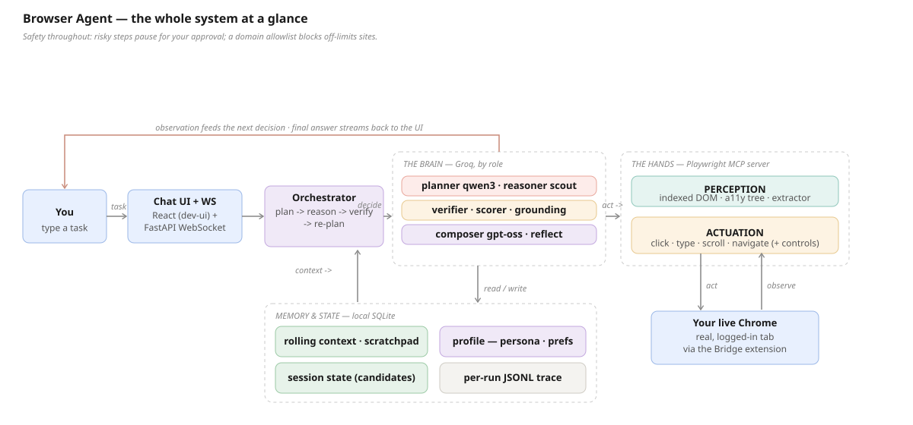
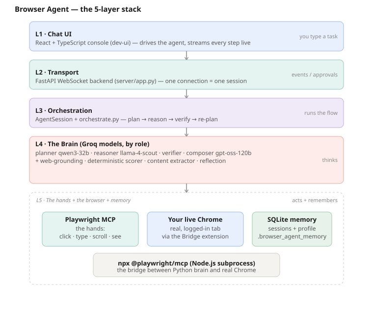
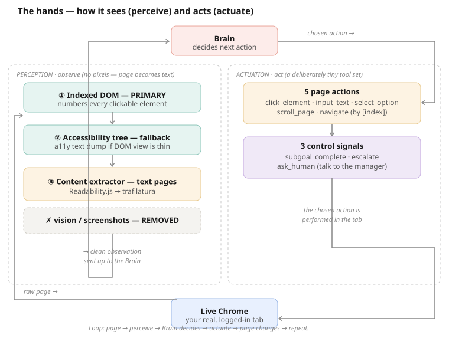
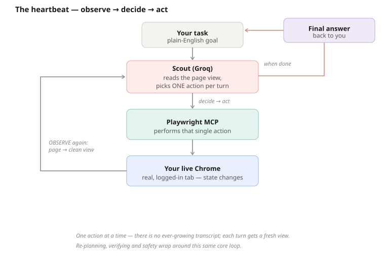
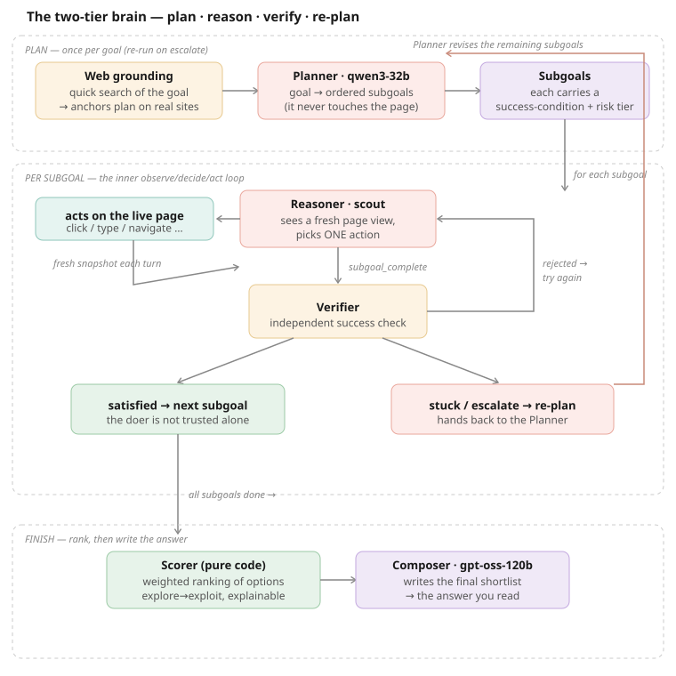
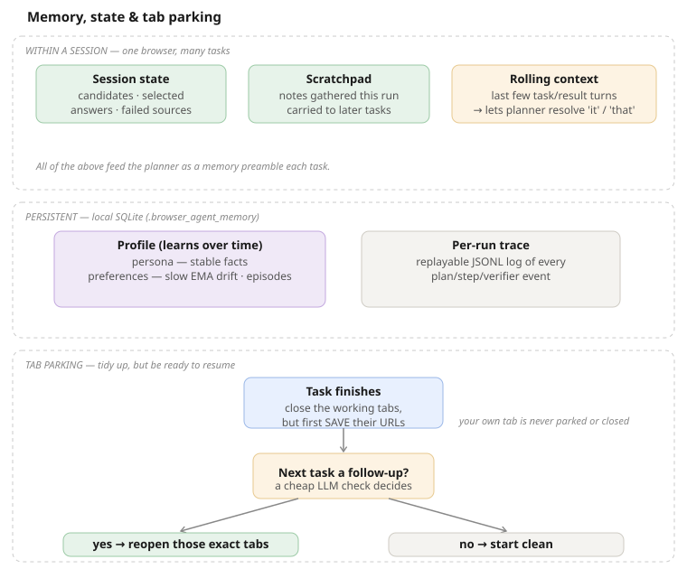

# Browser Agent

Personal browser-automation agent. Brains = Groq, split by role (see `config.py`): planning →
`qwen/qwen3-32b` (thinking), reasoning + structured outputs → `llama-4-scout-17b-16e-instruct`,
final prose/shortlist → `openai/gpt-oss-120b`.

This project explored **two stacks**. We pivoted to Path B for live-profile control:

| | Path A (built, kept as reference) | **Path B (active)** |
|---|---|---|
| Hands | `browser-use` over CDP | **Playwright MCP** (`@playwright/mcp --extension`) |
| Brain | Groq Scout via `ChatGroq` | **Groq Scout via a custom MCP client** |
| Profile | attach via `cdp_url` (relaunch Chrome) | **live, already-open Chrome via the extension** |
| Entry point | `hello_world.py` | `scout_mcp_agent.py` |

**Why Path B:** the Playwright MCP Bridge extension attaches to your *currently running*,
logged-in Chrome — no relaunch, no debug-port flag — reusing your SSO/2FA/cookies. The cost
is needing Node.js and writing our own MCP client so Scout stays the brain (`scout_mcp_agent.py`).

## Architecture (Path B)

**The whole system at a glance** — you type a task; the orchestrator runs plan → reason → verify
→ re-plan on the Groq brain (split by role); the Playwright MCP server *perceives* and *actuates*
your live Chrome; and local SQLite holds memory, session state, and a replayable per-run trace.
Safety runs throughout: risky steps pause for your approval and a domain allowlist blocks
off-limits sites.



The same stack seen as **five layers** — chat UI, orchestrator + brain, the hands (Playwright
MCP), your browser, and memory:



In text, the core request/response cycle is just:

```
task ─► Scout (Groq, tool-calling) ─► picks one tool call
            ▲                              │
       tool result ◄── Playwright MCP server (stdio, our subprocess)
                              │ --extension + PLAYWRIGHT_MCP_EXTENSION_TOKEN
                              ▼
                   Playwright MCP Bridge extension ─► your live Chrome
```

**Perception & actuation** — how the agent *sees* and *acts*: it perceives each page as an
indexed DOM / accessibility tree (with the content extractor as a fallback for opaque pages),
then actuates with `click` / `type` / `scroll` / `navigate` (plus synthetic control actions) over
Playwright MCP.



The code lives in an installable `browser_agent` package (`src/` layout).

## Project layout

```
src/browser_agent/
  config.py              PLANNER/REASONING/COMPOSITION models, limits
  log.py                 logging tree (get_logger) + EventRecorder (per-run JSONL traces)
  services/
    groq_service.py      Groq client factory (the brain)
    mcp_client.py        Playwright MCP session, schema/snapshot helpers (the hands)
  agent/
    prompts.py           system prompts (flat / planner / reasoner / verifier)
    tools.py             synthetic actions (subgoal_complete / escalate / ask_human) + exclusions
    grounding.py         pre-planning web search -> grounds the planner's source choices
    planner.py           plan_subgoals (web-grounded, category-aware)
    reasoner.py          reasoner_decide (one action per turn, text-only)
    reader.py            content extractor — Readability.js -> trafilatura (replaced vision)
    verifier.py          verify_success (independent check)
    context.py           Tier-1 basic context (time/device/profile)
    scoring.py           deterministic candidate scorer (explore->exploit)
    extract.py reflect.py  candidate extraction; post-task memory-update reflection
    in_page_prompt.py    in-tab overlay for HITL questions/approvals (extension mode)
    orchestrate.py       run_subgoal + plan/verify/re-plan, type dispatch, HITL tiers
    flat.py              flat single-loop agent  (agent_loop, run_agent, CLI)
    session.py           AgentSession: ONE persistent browser + memory, many tasks; writes a per-run trace
    main.py              two-tier entry (run, CLI); re-exports run_subgoal
  vendor/readability/    vendored Mozilla Readability.js (injected in-page by reader.py)
  memory/                session + profile memory -> SQLite (.browser_agent_memory/)
    store.py rolling.py scratchpad.py session.py profile.py
  server/
    app.py               FastAPI WebSocket backend for the chat UI
    logging.py           back-compat shim → re-exports log.py's EventRecorder/configure_logging
  utils/                 text (extract_json, snapshot_is_sufficient), domains, io
test/                    pytest deterministic suite (fakes; no network)
scripts/                 live runners + eval_set + hello_world + pages/ (html fixtures)
dev-ui/                  React + TypeScript chat console
docs/                    the execution plan + architecture diagrams (01–06 *.svg)
pyproject.toml  makefile
```

Install it editable: `python -m pip install -e ".[dev]"` (or `make install`).

## Chat UI (manual testing)

A React + TypeScript chat console drives either agent and streams every step live.

```
React UI (dev-ui/, Vite :5173) ──WebSocket──► browser_agent.server.app (FastAPI :8000) ──► agent
   chat thread + run timeline      events/approvals    wraps run()/run_agent with emit
```

Run it in **two terminals** (both need Node on PATH; the backend needs the venv + Groq key):

```powershell
# Terminal 1 — backend (streams agent events over ws://localhost:8000/ws)
.\.venv\Scripts\python.exe -m uvicorn browser_agent.server.app:app --port 8000
# (or, after install:  browser-agent-server)

# Terminal 2 — frontend (first time: cd dev-ui ; npm install)
cd dev-ui ; npm run dev          # open the printed http://localhost:5173
```

The UI always drives your **live, logged-in Chrome** (via the Playwright extension) — smoke
mode was removed from the product (it remains only for internal test scripts). In the UI: pick
the **agent** (two-tier / flat), an optional **domain allowlist** and **content-extractor** toggle, type a
task (**Enter sends, Shift+Enter for a newline**), and watch the plan, per-subgoal steps,
verifier checks, and result stream in. `ask_user` disambiguation pops up a **modal dialog**
(radio buttons for single-choice, checkboxes for multi-choice) with an **"Other…"** row that
reveals a write box; when the agent pauses to ask, it switches your browser back to the chat
tab so you see it.

## Two agents (flat vs. two-tier brain)

| Agent | What it is | Plan phase |
|---|---|---|
| `agent/flat.py` | **Flat loop** — Scout picks one MCP tool at a time until it answers. Simple baseline. | 1–2 |
| `agent/main.py` | **Two-tier brain** — planner → per-subgoal reasoner → independent verifier → re-plan, with an approval gate + domain allowlist. | 3 + 5 |

Both agents share the same **heartbeat** — we hand the brain a fresh observation, it picks exactly
one action, we execute it, and we repeat until the goal is met (no growing transcript):



The two-tier agent realizes Appendix A of the plan on the Path B stack — **plan once, then reason
→ verify → re-plan** per subgoal:


- **Web grounding** (`web_grounding`, `agent/grounding.py`) → BEFORE planning, a quick live web
  search of the goal runs in the same browser; the top result titles + domains are prepended to the
  planner preamble so it anchors on real, goal-appropriate sources (jeans → fashion retailers, not
  tech stores) instead of guessing blind. Best-effort; `--no-grounding` skips it.
- **Planner** (`plan_subgoals`) → ordered subgoals JSON, each with a `success_condition` and a
  `needs_approval` flag. Category-aware: every explore source must sell the goal's category. Re-plan
  variant rewrites the remainder on escalate/exhaust.
- **Reasoner** (`reasoner_decide`) → one action per turn. *We* take a fresh `browser_snapshot`
  each turn (the observation); Scout chooses one action — a real MCP tool or a synthetic control
  action (`subgoal_complete` / `escalate` / `ask_human`). No growing transcript.
- **Verifier** (`verify_success`) → a separate, focused Scout call that sees only the success
  condition + a fresh snapshot. The reasoner's `subgoal_complete` is not trusted on its own.
- **Safety (Phase 5)**: a subgoal with `needs_approval=true` pauses for a y/N; `--allow dom1,dom2`
  blocks any action whose host isn't allowlisted (subdomain-aware).
- **Content extractor (replaced the Phase-6 vision fallback)**: when a page's DOM snapshot is
  empty/opaque (`snapshot_is_sufficient()` is false — e.g. a JS app, canvas, or CAPTCHA), the
  orchestrator turns the LIVE page into clean text — vendored **Mozilla Readability.js** injected
  in-page via `browser_evaluate`, with **trafilatura** on the raw HTML as a fallback — and appends
  it to the reasoner's observation (`agent/reader.py`). No screenshots. `--no-extract` turns it off.
  Proven live on a content page (`scripts/test_extract_e2e.py`).

```powershell
# Two-tier agent, smoke mode (own browser):
.\.venv\Scripts\python.exe -m browser_agent.agent.main "search Wikipedia for Mars and report the first sentence"
# Live profile, restricted to one domain:
.\.venv\Scripts\python.exe -m browser_agent.agent.main --extension --allow github.com "open my notifications and summarize them"
# (after install, the console script `browser-agent` is equivalent)
```

## Sessions & memory

How **memory, session state, and tab parking** fit together — within a session one browser serves
many tasks, working tabs are parked (closed + remembered) and reopened on a follow-up, and
everything persists to local SQLite:



A **session** = one persistent browser + one memory record. `AgentSession` opens the Playwright
MCP browser **once** and runs many tasks against it. The browser is torn down **only when the
session closes**: in smoke mode that closes the tabs; in extension mode it just disconnects (your
real Chrome is never closed by us). In the chat UI, the session = the WebSocket connection
(closing/refreshing the tab ends it).

**Tab parking.** Rather than leaving the agent's tabs open and piling up, each task **closes its
working tabs when it finishes** but first **records their URLs**. On the next task a cheap LLM
call decides whether it's a **follow-up** of the previous one — *"now scroll down and summarise
that"* — and if so **reopens those exact tabs** so the agent resumes where it left off; an
unrelated task starts clean instead. The chat/origin tab you were on before automation is never
parked or closed. The UI sees `tabs_parked` / `tabs_reopened` events. (Parking only kicks in when
there's an identifiable origin tab to preserve — i.e. extension mode — so a lone CLI tab is never
closed out from under you.)

Each session carries **memory**, persisted to SQLite at `.browser_agent_memory/memory.db`,
keyed by session id:
- **Rolling context window** (`memory/rolling.py`) — the last few task/result turns, capped by
  count *and* a char budget. Fed to the planner so it can resolve "it / that / the same page".
- **Scratchpad** (`memory/scratchpad.py`) — notes gathered during a run (e.g. extracted data),
  carried forward to later tasks in the session.

The two-tier planner receives a memory **preamble** (rolling history + scratchpad); the flat
agent is seeded with prior turns. From the CLI, pass `--session <id>` to persist memory across
separate invocations:

```powershell
.\.venv\Scripts\python.exe -m browser_agent.agent.main --session work "go to my repo's issues"
.\.venv\Scripts\python.exe -m browser_agent.agent.main --session work "open the newest one"   # remembers
```

### Logs & traces

Logging is centralized in `log.py`: every module logs through `get_logger(__name__)`, and each
run's `emit` events (plan, subgoal_start, step, action_result, verifier, replan, candidates,
run_started/finished, …) are appended to a **replayable per-run JSONL trace** via `EventRecorder`
— one file per run under `.browser_agent_memory/logs/` (`run-<session>-<ts>.jsonl`), plus a rolling
`server.log`. `run_task` writes a trace by default (`trace=False` to skip when the caller records
its own, e.g. the server). Tune with `BROWSER_AGENT_LOG_DIR` / `BROWSER_AGENT_LOG_LEVEL`. All trace
I/O is best-effort, so logging never breaks a run.

## Personalized, context-aware planner (enhancement plan)

On top of the basics, the planner is **personalized and learns** (see
`docs/browser_agent_planner_enhancement_plan.md`, M8–M11):

- **Tier-1 context** (`agent/context.py`) — time / device / profile is rebuilt each run and
  injected into the planner (gates "is the store open", which sites are already logged in, …).
- **Tier-2 profile memory** (`memory/profile.py`) — persona + preferences + episodic history,
  persisted in SQLite under a profile id (`--profile`, default `default`). Persona is stable;
  preferences drift via a **recency-weighted EMA** (one observation never flips them); an
  explicit correction overrides. Only a few *relevant* history records are surfaced per goal.
- **Explore → exploit** (proposer–verifier) — the LLM *explores* (gathers candidate options),
  and a **deterministic weighted scorer** (`agent/scoring.py`) *exploits* (ranks + picks), so the
  choice is personalized and explainable rather than the model's gut pick.
- **HITL risk tiers** — every subgoal is tagged `auto` / `confirm` / `secured`; confirm and
  secured pause for approval **before** acting (payments/deletes/sends are always `secured`),
  with a no-answer **timeout that aborts** (never auto-proceeds).
- **ask_user disambiguation** — on ambiguity / near-ties, the planner asks with selectable
  **single- or multi-choice options + a free-text escape hatch**; the UI tab is refocused so the
  question is seen. For purchases it **explores across multiple retailers** (region-aware, never
  straight to one brand site) and accumulates candidates before the scorer picks.
- **Memory-update** (`agent/reflect.py`) — after each task a cheap reflection appends an episode
  and nudges preferences, so the agent improves over runs.

## Setup

```powershell
# 1. Editable install (creates the venv first if needed):
py -m venv .venv
.\.venv\Scripts\python.exe -m pip install -e ".[dev]"

# 2. Groq key: https://console.groq.com/keys  -> put in .env  (DONE: key is set)

# 3. Node.js (needed for `npx @playwright/mcp`):
winget install --id OpenJS.NodeJS.LTS -e

# 4. Install the "Playwright MCP Bridge" Chrome extension:
#    https://chromewebstore.google.com/detail/playwright-mcp-bridge/mmlmfjhmonkocbjadbfplnigmagldckm
#    Open its popup, copy the token, add to .env as PLAYWRIGHT_MCP_EXTENSION_TOKEN=...
```

## Run

```powershell
# Flat agent, smoke (Playwright MCP launches its own Chrome — zero risk):
.\.venv\Scripts\python.exe -m browser_agent.agent.flat "go to example.com and read the heading"

# Flat agent, live profile (your already-open, logged-in Chrome via the extension):
.\.venv\Scripts\python.exe -m browser_agent.agent.flat --extension "summarize my open GitHub tab"
```

Console scripts after install: `browser-agent` (two-tier), `browser-agent-flat`, `browser-agent-server`.

## Testing

```powershell
# deterministic pytest suite (fakes; no network/browser):
.\.venv\Scripts\python.exe -m pytest          # 114 passed   (or: make test)

# live runners in scripts/ (real Groq + real browser; non-deterministic):
.\.venv\Scripts\python.exe scripts\test_mcp_tools.py             # all 23 MCP tools: 23/23
.\.venv\Scripts\python.exe scripts\test_agent_e2e.py             # flat agent end-to-end
.\.venv\Scripts\python.exe scripts\test_planner_reasoner_e2e.py  # two-tier end-to-end
.\.venv\Scripts\python.exe scripts\test_extract_e2e.py           # content extractor on an article page
.\.venv\Scripts\python.exe scripts\eval_set.py                   # flat-agent eval success rate
.\.venv\Scripts\python.exe scripts\eval_planner.py               # planner: source-category rate
.\.venv\Scripts\python.exe scripts\eval_reasoner.py              # reasoner: action-category rate
```

`test/` (pytest) covers, via *fake* Groq + *fake* MCP session:
- `test_flat_agent.py` — flat `agent_loop`: terminates on final answer, feeds tool results back,
  recovers from the `tool_use_failed` 400 (Scout JSON wobble), gives up after the retry cap,
  handles malformed arg JSON / tool exceptions, respects `max_steps`; plus MCP-helper units.
- `test_planner.py` — planner role: JSON parse/normalize + retry, the re-plan prompt shape, and
  the source-category enhancements (web-grounding reaches the prompt; category-sanity rules).
- `test_reasoner.py` — reasoner role: one-action-per-turn, `tool_use_failed` recovery, the verifier
  (satisfied + malformed), every `run_subgoal` branch (complete+verify, verifier-reject→escalate,
  allowlist-block, loop-detect, exhaust, follow-new-tab), and the content-extractor fallback.
- `test_reader.py` — the content extractor: parses Readability JSON from a faked `browser_evaluate`
  result, falls back to trafilatura, and returns None (never raises) when nothing is usable.
- `test_grounding.py` — `web_grounding`: builds the block from results, skips URL-in-goal / no
  session, and degrades to "" on a bot-wall or navigation error.
- `test_orchestrate.py` — orchestrate flow: candidate salvage, blocked-source re-plan steering,
  clarification cap, and role→model wiring.
- `test_memory.py` — SQLite store, rolling-context window (turn + char caps), scratchpad,
  session isolation, and the MemorySession preamble/history.
- `test_enhanced.py` — the deterministic scorer, basic context, ProfileMemory (EMA drift,
  correction, relevant-history retrieval), and subgoal type/tier normalization.
- `test_session.py` — `AgentSession`: chat-tab focus selection + origin-tab fallback, and the
  per-run JSONL trace file `run_task` writes (written, disabled via `trace=False`, and on error).
- `test_in_page_prompt.py` — the in-tab overlay: payload/JS build, reply parsing, and the
  show→poll→cleanup flow (returns None when injection isn't possible so the caller falls back).
- `test_server_logging.py` — `EventRecorder` JSONL output (one line per event, tolerates
  unserializable values, no-ops without a writable dir) and idempotent `configure_logging`.

The loops take **injectable dependencies** (Groq client + MCP session) so the deterministic
tests drive them with fakes — `agent_loop` in `agent/flat.py`, and
`run_subgoal`/`plan_subgoals`/`verify_success` in `agent/{main,planner,verifier}.py`.

`scripts/test_mcp_tools.py` exercises all 23 Playwright MCP tools directly (no LLM) against
local pages, using `browser_evaluate` as an oracle to confirm real state changes.

Gotchas these surfaced (baked into the agent / tests):
- Playwright MCP **blocks `file://`** — serve test pages over http.
- `browser_file_upload` **denies the sandbox temp dir** (`...\Temp\claude\`); keep upload
  files in the project dir.
- A stuck **file-chooser modal cascades** — every later tool errors with "does not handle the
  modal state" until you fill or cancel it (empty `paths` cancels).
- `browser_network_request` is **1-indexed**.
- `browser_snapshot` returns inline only when `filename` is **omitted**.

## Notes (verified against installed versions)

- **Python**: use the `py` launcher / the venv's python; plain `python` is not on PATH.
- **MCP SDK** `mcp 1.26.0`, **Groq SDK** `groq 1.0.0` — both async; client uses `AsyncGroq`
  + `ClientSession` over `stdio_client`. On Windows the server command is `npx.cmd`.
- **browser-use** is the Path A fallback in `scripts/hello_world.py` (install it with the
  optional extra: `pip install -e ".[path-a]"`). CDP-native, no Playwright install needed.

## Status

- [x] Phase 0 — env (Python 3.12, Chrome, Groq key set)
- [x] Path A hello-world (`scripts/hello_world.py`) — fallback
- [x] Path B custom Scout MCP client (`agent/flat.py`)
- [x] Node.js LTS installed (v24, npx 11) + Playwright MCP 0.0.75 cached
- [x] **Smoke test PASSED** — Scout drove Playwright MCP to example.com and answered
- [x] Tool-wobble guard — recovers from Groq `tool_use_failed` 400s (Scout sends wrong JSON types)
- [x] Playwright MCP Bridge extension installed + token in `.env`
- [x] **Live profile CONFIRMED** — `--extension` run read the real signed-in Google
      account off google.com, proving session/login reuse (plan Phase 4 / M5)
- [x] **All 23 MCP tools tested green** (`scripts/test_mcp_tools.py`: 23 passed / 0 failed)
- [x] **Two-tier brain built** (`agent/main.py`) — planner + reasoner + verifier + re-plan.
- [x] **Phase 5 safety done** — subgoal approval gate + `--allow` domain allowlist (enforced in code)
- [x] **Phase 6 done** — opaque-page fallback + eval set. M1–M7 met. (The original vision/screenshot
      fallback has since been **replaced by a content extractor**: Readability.js → trafilatura.)
- [x] **Web-grounded, category-aware planner** — a pre-planning web search grounds source choices
      (fixes "jeans → tech store" wild planning); per-role eval sets (`eval_planner`, `eval_reasoner`).
- [x] **Refactored into the `browser_agent` package** (src/ layout) + pytest suite + React dev-ui.
- [x] **Sessions + memory** — `AgentSession` keeps one browser across tasks; parks (closes +
      remembers) the working tabs after each task and reopens them on a follow-up; SQLite-backed
      rolling-context window + scratchpad per session.
- [x] **Personalized planner (M8–M11)** — Tier-1 context + persona/preferences, HITL risk tiers,
      explore→exploit deterministic scorer, ask_user disambiguation, and a recency-weighted
      memory-update loop. pytest: **114**.
- [ ] Phase 7 (optional) — local model (Ollama/vLLM), two-model split, cloud browsers

### Extension-mode notes (learned the hard way)
- The `connect.html` page is the extension's **tab picker**; your existing tabs don't show
  up in `browser_tabs` until you pick one there. The picker path is finicky (`--pick-tab`
  opt-in). The reliable model is: the controlled tab lives in your real profile, so just
  **navigate it** to a site and it loads with your existing logins.
- **The browser cannot auto-switch to the dev-ui to ask a question — by design.** The Playwright
  MCP extension only monitors its own *group* of tabs (the ones it created/attached inside its
  context). The dev-ui tab is opened by you, outside that group, so `browser_tabs` never lists it
  and `focus_chat_tab` can't raise it. Pulling the dev-ui inside the group isn't viable either: the
  agent would navigate it away to browse, or it'd spawn a duplicate WebSocket session. So we do NOT
  rely on tab-switching. Instead, in extension mode the agent renders the question/approval as an
  **overlay in the tab it's driving** (`in_page_prompt.py`) — which is already in front of you while
  you watch automation — and reads your answer back by polling the DOM via `browser_evaluate`. No
  tab-switch needed. If the overlay can't render (e.g. the current page is a `chrome-extension://`
  page, as during a clarify question asked *before* any browsing) or you don't answer in time, it
  falls back to the dev-ui modal over the WebSocket, and the dev-ui flashes its title + beeps +
  fires a desktop notification (`useAttention.ts`) so you notice it there.
- Do NOT let the model pass `filename` to `browser_snapshot` — that saves to disk instead of
  returning the snapshot. The system prompt now forbids it.

### Known quirk
Scout occasionally emits booleans/numbers as quoted strings (`"false"`, `"1"`) for optional
tool params; Groq rejects these with a 400 `tool_use_failed`. The agent loop catches it,
feeds the error back, and Scout retries (capped at 4). The system prompt also tells Scout to
omit optional params and use correct JSON types, which mostly prevents it.
```
